# 🚀 Ebrahimi Portfolio & AI-Powered Career Platform

<div align="center">

[](https://www.python.org/)
[](https://flask.palletsprojects.com/)
[](https://www.langchain.com/)
[](https://www.trychroma.com/)
[](https://www.docker.com/)
[](https://ebrahimi.sbs)

<p align="center">
  <b>An enterprise-grade, AI-native personal portfolio, career strategist, and server operations platform built with Flask, LangChain, ChromaDB, and modern web technologies.</b>
</p>

[Explore Live Demo](https://ebrahimi.sbs) • [Features](#-key-features) • [Admin Screenshots](#-visual-tour--admin-panel-showcase) • [Architecture](#-system-architecture) • [Getting Started](#-getting-started) • [Deployment](#-docker--production-deployment)

</div>

---

## 🌟 Overview

**Ebrahimi Website** is far more than a traditional portfolio website. It is an end-to-end, intelligent career platform designed to showcase engineering work, automate job applications with Generative AI, monitor server health, track visitor engagement, and provide interactive demos for prospective clients and recruiters.

At its core, the platform combines:
1. **RAG-Powered AI Chatbot:** An embedded career assistant that retrieves verified knowledge from your database to answer visitor queries with zero hallucinations.
2. **AI Resume & Cover Letter Strategist:** An automated workflow that analyzes any target Job Description (JD), checks profile compatibility, tailors bullet points, optimizes ATS keywords, and compiles clean PDF resumes alongside custom cover letters.
3. **Full Content Management System (CMS):** Complete web control over projects, skills (drag-and-drop reordering), experiences, education, and hosted client demos.
4. **Built-in DevOps & Server Control Center:** Real-time hardware telemetry (CPU, RAM, Disk, Network I/O), Fail2ban jail management, UFW firewall rule controls, and Docker container inspection.
5. **Privacy-Friendly Visitor Analytics:** Real-time traffic monitoring, bot/scanner filtering, IP geolocation, referrer breakdown, and CSV data export.

---

## 📸 Visual Tour & Admin Panel Showcase

Below is a detailed visual walkthrough of the custom admin control panels and features built into this platform:

### 1. Main Admin Control Center
The unified command dashboard provides instant access to content management, AI synchronization, server telemetry, and analytics.

<div align="center">
  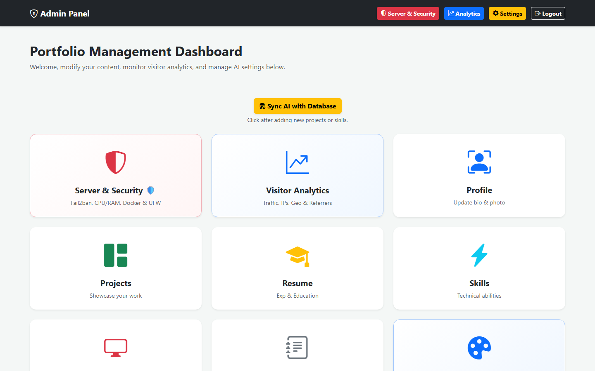
  <p><i>The central control hub featuring quick actions, sync triggers, and modular management tiles.</i></p>
</div>

---

### 2. Real-Time Visitor Analytics
Track real human visits versus automated bot crawlers. Features detailed IP geolocation, ISP identification, referrer tracking, traffic timeline charts, and instant CSV export.

<div align="center">
  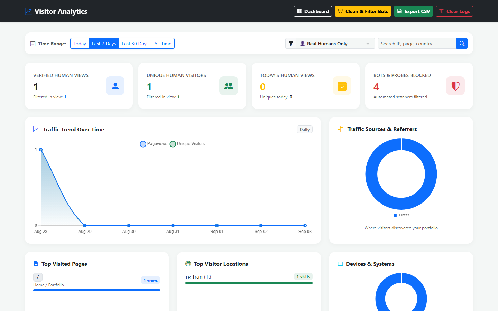
  <p><i>Traffic trends, human vs. bot filtering, geo-distribution, device breakdown, and referrer analytics.</i></p>
</div>

---

### 3. Server & Security Operations Center
A built-in DevOps monitor directly inside the web dashboard. Tracks live CPU load, per-core utilization, RAM/Swap, disk partitions, real-time network I/O speed, Fail2ban IP bans, UFW firewall rules, and Docker containers.

<div align="center">
  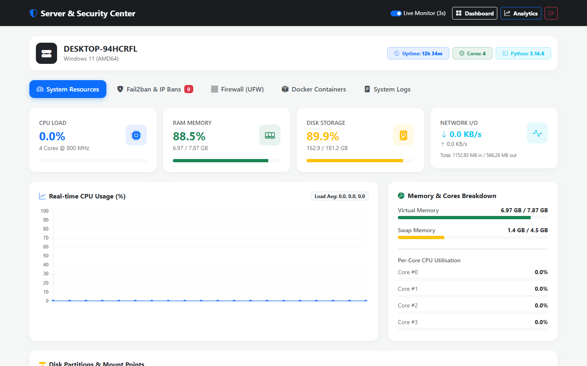
  <p><i>Hardware metrics, active processes, Fail2ban jail status, and firewall security controls.</i></p>
</div>

---

### 4. AI Resume & Cover Letter Strategist
Paste any job description to trigger a 2-stage AI pipeline:
- **Step 1: Fit & Strengths Assessment:** Matches candidate background against required qualifications, highlighting strengths and missing keywords.
- **Step 2: Tailored ATS Resume & Cover Letter:** Generates customized bullet points and an authentic, human-written cover letter.

<div align="center">
  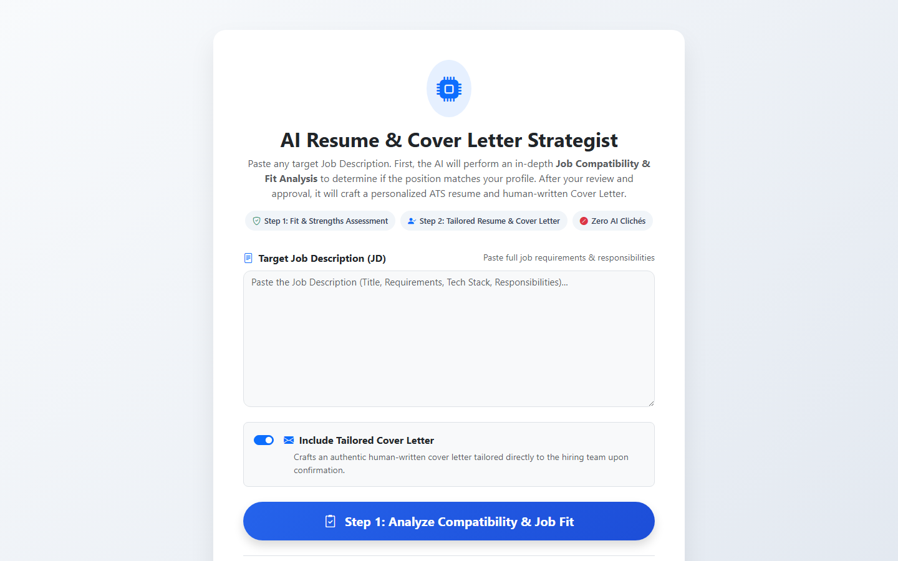
  <p><i>Two-step AI strategist for analyzing job compatibility and drafting ATS-optimized applications.</i></p>
</div>

---

### 5. Dedicated AI Provider & LLM Settings
Configure separate AI providers, API keys, models (Gemini, Claude, Llama 3, DeepSeek), reasoning parameters, and token/request quotas independently for the public chatbot and the resume generator.

<div align="center">
  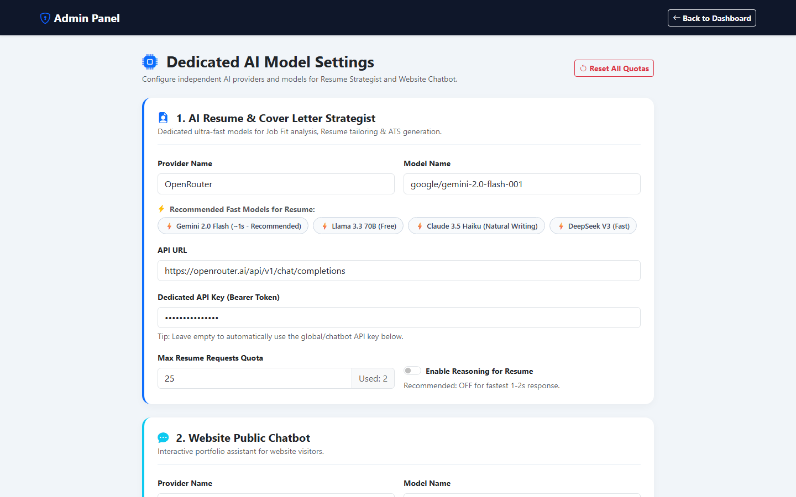
  <p><i>Independent LLM configuration, endpoint management, quota limits, and test latency tools.</i></p>
</div>

---

### 6. ATS-Optimized Resume Template Gallery
Switch between 4 professionally engineered, 100% ATS-compliant PDF resume layouts with a single click.

<div align="center">
  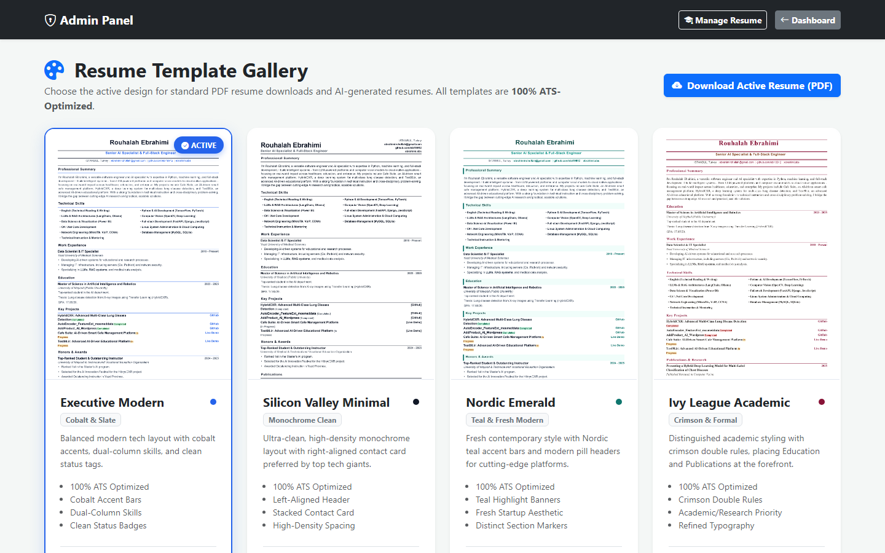
  <p><i>Executive Modern, Silicon Valley Minimal, Nordic Emerald, and Ivy League Academic templates.</i></p>
</div>

---

### 7. Interactive Manual Resume Builder
When manual customization is preferred, easily reorder experience items and skills with drag-and-drop, toggle visibility, customize career summaries per role, and export to PDF on demand.

<div align="center">
  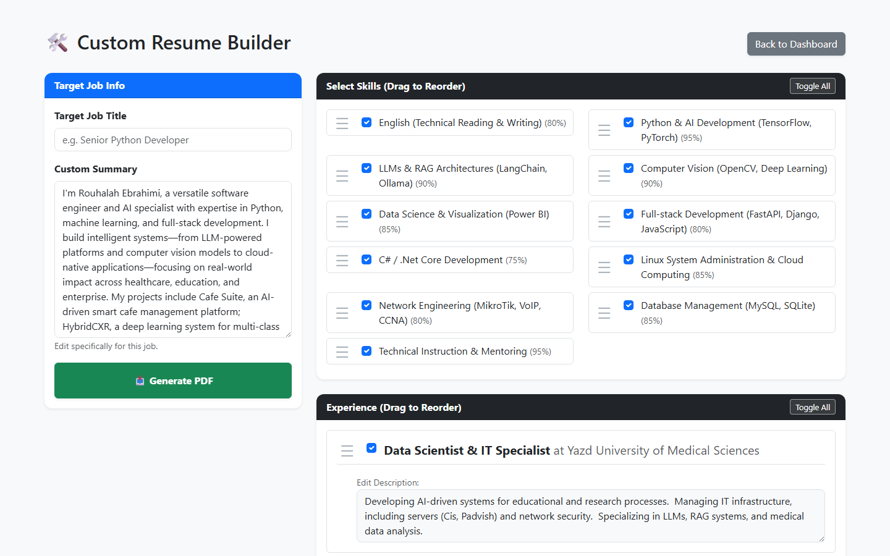
  <p><i>Interactive drag-and-drop selection for tailored resume generation.</i></p>
</div>

---

### 8. Portfolio Projects & Asset Management
Showcase software applications, research papers, and client projects with GitHub links, live demo links, video embeds, tags, and media uploads.

<div align="center">
  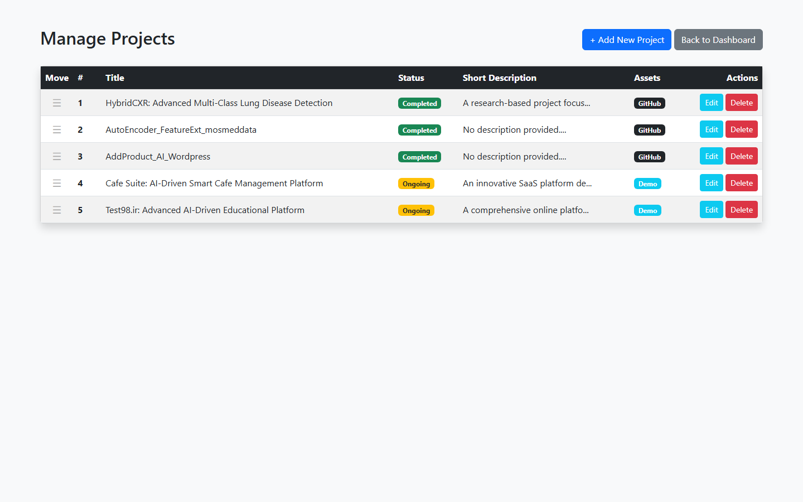
  <p><i>Reorderable project list with status badges, media attachments, and link management.</i></p>
</div>

---

### 9. Skills & Proficiency Manager
Organize technical capabilities into proficiency levels with drag-and-drop visual ordering.

<div align="center">
  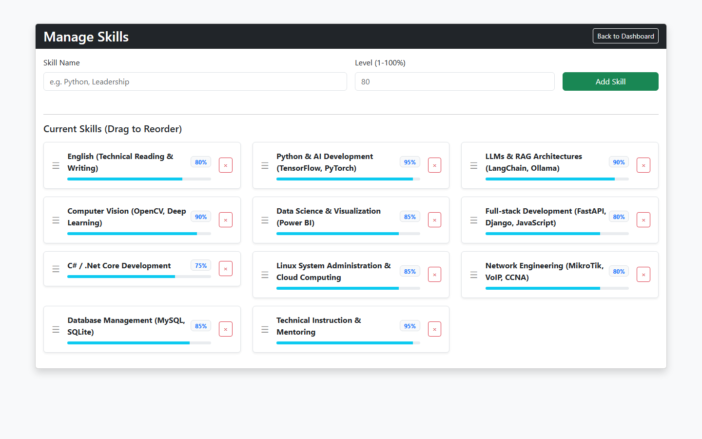
  <p><i>Visual skills manager with live percentage badges and order controls.</i></p>
</div>

---

### 10. Instant Website Demos Deployment
Upload standalone static website demos as `.zip` archives. The system automatically extracts, verifies, and hosts them under unique slugs (e.g., `/demo/client-site/`).

<div align="center">
  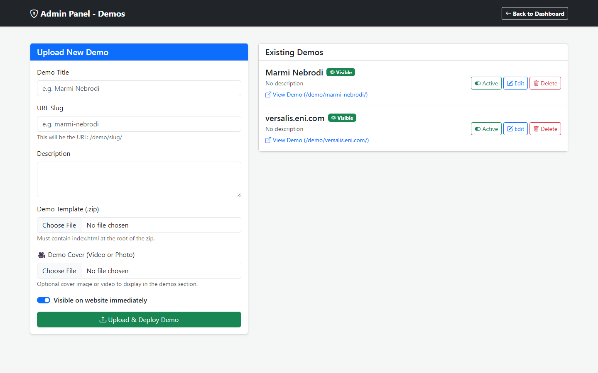
  <p><i>Zero-friction zip deployer for interactive client demos and web templates.</i></p>
</div>

---

## ⚡ Key Features

| Category | Features Included |
| :--- | :--- |
| 🧠 **AI & RAG Engine** | Retrieval-Augmented Generation using LangChain, HuggingFace embeddings (`all-MiniLM-L6-v2`), ChromaDB vector store, OpenRouter multi-model support (Gemini, Claude, DeepSeek, Llama). |
| 📄 **Resume Generation** | AI-driven job-fit analyzer, ATS keyword optimization, automated cover letter generator, manual drag-and-drop builder, 4 ATS-friendly PDF themes compiled via `xhtml2pdf`. |
| 🛡️ **DevOps & Server** | Real-time CPU, RAM, Disk, and Network telemetry (`psutil`), Fail2ban management, UFW firewall controller, Docker container inspector, system log viewer. |
| 📊 **Visitor Analytics** | Privacy-focused tracking, IP Geolocation, ISP resolution, real-time traffic charts, human vs. scanner/bot classifier, CSV export. |
| 🌐 **Interactive Demos** | In-browser client website hosting via `.zip` upload, slug routing, asset isolation, and instant toggle of public visibility. |
| ✍️ **Blog & SEO Suite** | Rich-text blogging engine, automated dynamic XML sitemap generation (`/sitemap.xml`), and search engine `robots.txt` configuration. |
| 🔒 **Security & Auth** | `Flask-Bcrypt` password hashing, `Flask-Login` session protection, dynamic mathematical CAPTCHA on login, file upload sanitization via `Werkzeug`. |

---

## 🏗️ System Architecture

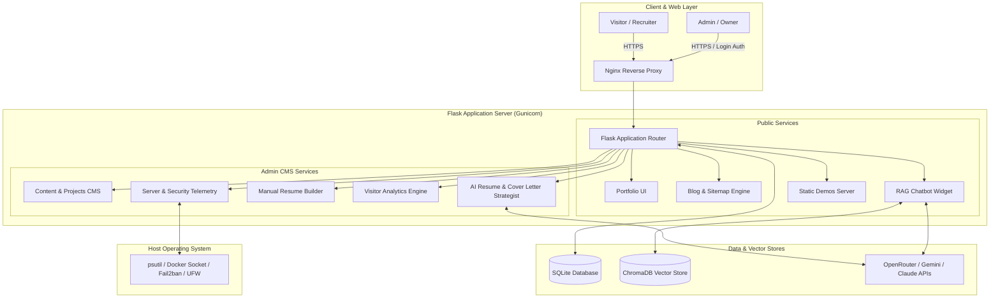

---

## 📁 Project Structure

```plaintext
ebrahimi_website/
├── app.py                     # Core Flask application, routing, auth & API endpoints
├── models.py                  # SQLAlchemy models (Admin, Profile, Project, Skill, etc.)
├── rag_utils.py               # Vector DB initialization, embeddings & context retrieval
├── server_utils.py            # Hardware metrics, Docker, Fail2ban, and UFW controllers
├── forms.py                   # Form validation definitions
├── requirements.txt           # Python package dependencies
├── Dockerfile                 # Multi-stage production container definition
├── docker-compose.yml         # Container orchestration with volume mounts
├── .env                       # Environment configuration secrets
├── docs/
│   ├── app_core.md            # Microservice documentation for app.py
│   ├── database_models.md     # Schema breakdown for models.py
│   ├── rag_engine.md          # Architecture breakdown of RAG pipeline
│   └── screenshots/           # High-resolution screenshots of the platform
├── static/
│   ├── css/                   # Stylesheets and custom layout definitions
│   ├── js/                    # Client-side scripts and interactive widgets
│   ├── demos/                 # Extracted client website demos
│   ├── uploads/               # Project media and profile assets
│   └── img/templates/         # Resume template preview assets
└── templates/
    ├── index.html             # Public portfolio frontend
    ├── admin_dashboard.html   # Main admin command center
    ├── admin_analytics.html   # Visitor analytics dashboard
    ├── admin_server.html      # Server health & security control panel
    ├── admin_ai_resume.html   # AI Resume & Cover Letter Strategist
    ├── admin_ai_settings.html # LLM provider & quota management
    ├── admin_manual_builder.html # Interactive manual resume builder
    ├── admin_resume_templates.html # ATS resume theme gallery
    ├── resume_pdf_template.html    # Base PDF print template
    └── chat_widget.html       # Embedded AI assistant widget
```

---

## 🚀 Getting Started

Follow the instructions below to get a local development instance up and running.

### Prerequisites
- **Python 3.10+** (Tested on Python 3.12 and 3.14)
- **Git**
- Optional: **Docker & Docker Compose** for containerized setup

### 1. Clone the Repository
```bash
git clone https://github.com/ebi19912/ebrahimi.sbs.git
cd ebrahimi.sbs
```

### 2. Set Up a Virtual Environment
```bash
# On Linux / macOS:
python3 -m venv venv
source venv/bin/activate

# On Windows (PowerShell):
python -m venv venv
.\venv\Scripts\Activate.ps1
```

### 3. Install Dependencies
```bash
pip install --upgrade pip
pip install -r requirements.txt
```

### 4. Configure Environment Variables
Create a `.env` file in the root directory:
```env
# Flask Security
FLASK_SECRET_KEY=generate_a_random_secure_secret_key_here

# AI & LLM Provider Keys
OPENROUTER_API_KEY=your_openrouter_api_key_here

# Optional: Environment flag
FLASK_ENV=development
```

### 5. Initialize the Database & Admin
The database is automatically created on first launch. If you want to update or customize your credentials:
```bash
python update_admin.py
```
> **Default Admin Credentials:**
> - **Username:** `admin`
> - **Password:** `123` *(Change this immediately upon logging in)*

### 6. Run the Application
```bash
python app.py
```

The application will be accessible at:
- **Public Portfolio:** [http://localhost:5000](http://localhost:5000)
- **Admin Control Panel:** [http://localhost:5000/login](http://localhost:5000/login)

---

## 🐳 Docker & Production Deployment

For production deployments, the application includes a production-ready `Dockerfile` and `docker-compose.yml` configured with Gunicorn and an Nginx reverse proxy.

### Quick Start with Docker Compose
```bash
# Build and run in detached mode
docker-compose up -d --build
```

### Key Production Configuration Highlights
- **Volume Mounts:** Persistent storage for user uploads (`/static/uploads`), hosted demos (`/static/demos`), and the SQLite database (`/instance`).
- **DevOps Integration:** Mounts `/var/run/docker.sock`, `/var/log`, and `/var/run/fail2ban` into the container in read-only mode, enabling the Server & Security panel to monitor host metrics securely.
- **Reverse Proxy:** Nginx routes incoming HTTP/HTTPS requests to Gunicorn on port `5000` with optimized timeouts for AI generation workflows.

---

## 🌐 Live Portfolio & Showcase

Experience the live, production deployment of this application:

<div align="center">

### 🔗 [https://ebrahimi.sbs](https://ebrahimi.sbs)

**Rouhalah Ebrahimi**  
*AI & Software Engineer*  

[](https://ebrahimi.sbs)
[](https://github.com/ebi19912)
[](mailto:ebrahimirohollah@gmail.com)

</div>

---

## 📄 License

This project is licensed under the **MIT License** — feel free to use, customize, and extend it for your own portfolio and career management needs.
